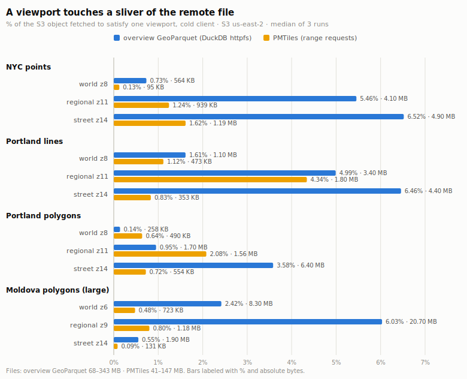

# Overview GeoParquet — access & storage benchmark (V3)

Generated 2026-07-03; revised 2026-07-03 with the **H1 writer fix** (the
tables below carry the post-H1 numbers — see the dated revision note after
Headline findings for the before→after deltas). These are the first published numbers comparing the
access and storage efficiency of **overview GeoParquet** (COG-style
multi-resolution levels embedded in one GeoParquet file, produced by
`gpq-tiles overview`) against the status-quo web-map deployment
(**gpio-optimized GeoParquet source + a tippecanoe PMTiles derivative**)
and against **COGP** (Kanahiro `cogp-rs`, thinning-only, no
simplification). Method transparency is the point: every number below is
reproduced by the committed scripts in this directory over the corpus in
`corpus/manifest.json`. Where a result looked anomalous we chased the root
cause rather than publishing it bare — see Caveats.

## Headline findings

For medium metro-scale datasets, a single duplicating-mode overview file
(self-contained levels, COG read semantics) is **smaller on disk than the
two-artifact status quo** it replaces — −27 % (points), −10 % (lines),
−3 % (polygons) versus gpio-source + PMTiles combined — while remaining a
valid, exact, SQL-queryable GeoParquet file. Its partitioning mode (each
feature once) costs only +4 to +47 % over the plain gpio file and tracks
cogp-rs within a few percent. **Conversion** is 18–24× faster than the
`gpio convert geojson | tippecanoe` pipeline on the medium datasets
because the overview path reads GeoParquet natively. The clear cost is
**per-viewport bytes over HTTP**: PMTiles fetches 1.1–18× fewer bytes than
the overview read protocol in all but one scenario, because MVT is lossy,
pre-tiled, quantized, and property-pruned, whereas the overview path
returns exact `f64` geometry plus all attribute columns and reads at
row-group granularity behind a (post-H1, small) parquet-footer tax. The
overview file therefore trades wire bytes for losslessness, full
attributes, and single-artifact simplicity; it does not beat purpose-built
vector tiles on bytes-to-paint-a-viewport, and on very large dense files
(Moldova) its conversion cost still amplifies sharply (see Caveats; the
per-viewport read amplification was largely a writer pathology fixed by
H1 — see the revision note).

## H1 revision (2026-07-03): writer row-group pathology fixed

The first publication of these numbers exposed a writer pathology on the
large file (Caveats 2–3 of the original run): the Moldova duplicating file
carried an **8.84 MB Thrift footer** (167 row groups × per-column min/max
statistics, dominated by the 26-char ULID `id` strings and raw WKB geometry
values), paid in full on **every** remote query before a single feature is
read. The H1 fix changed the writer defaults:

- **Statistics suppression** — per-row-group min/max stats are no longer
  written for the WKB geometry column or string/binary property columns
  (no reader used them). The bbox covering struct and `level` column keep
  full stats — they are the pruning index and are untouched. Opt back in
  with `--full-column-stats`.
- **Per-level row-group sizing** — `--row-group-size` is now a per-level
  cap: a level with fewer rows becomes a single row group; larger levels
  split into roughly **uniform** row groups instead of `10k, 10k, …,
  remainder`. Level↔row-group alignment is unchanged and all validate
  checks still pass.

Before → after on the affected artifacts (same inputs, same knobs,
`--row-group-size 10000` default retained — with stats suppressed the
footer is no longer a reason to enlarge row groups, and 10k keeps bbox
pruning granularity):

| metric | before (2026-07-03 orig) | after (H1) | Δ |
|---|---|---|---|
| Moldova dup footer | 8.84 MB | **0.24 MB** | −97 % |
| Moldova par footer | 3.65 MB | 0.10 MB | −97 % |
| Moldova dup file size | 411.39 MB | 359.83 MB | −12.5 % |
| Moldova dup vs status-quo | +63.6 % | **+43.1 %** | |
| Moldova par overhead vs gpio | +46.9 % | +33.6 % (now < cogp) | |
| Moldova world-viewport (z6) | 17.97 MB | **8.80 MB** | −51 % |
| Moldova regional-viewport (z9) | 37.59 MB | **21.80 MB** | −42 % |
| Moldova street-viewport (z14) | 10.76 MB | **2.02 MB** | −81 % |
| lines-portland dup footer | 0.27 MB | 0.07 MB | −73 % |
| polygons-portland regional | 2.17 MB | 1.86 MB | −14 % |

The metro no-regression check (polygons-portland-medium) improved in all
three viewports (569→265 KB world, 2.17→1.86 MB regional, 6.92→6.76 MB
street). Across all 9 metro cells, 7 improved; two point/line *regional*
cells rose ≤ 12 % (NYC 3.88→4.36 MB, Portland lines 3.28→3.57 MB) — the
uniform row-group split shifts band boundaries slightly, changing which row
groups a viewport overlaps — within run-shape noise and dwarfed by the
Moldova gains. Row counts, geometry, and attributes are byte-identical to
the original run; only the physical layout changed.

## Environment

| tool | version |
|---|---|
| gpq-tiles | 0.6.0 (branch `feat/geoparquet-overviews`, Q1 ranking + Q2 density budget + H1 layout fix) |
| tippecanoe | v2.49.0 |
| DuckDB | v1.4.1 (Andium), httpfs + spatial |
| gpio (geoparquet-io) | 1.1.0b1 |
| cogp-rs | 0.1.0 (git `61395124`) |
| Python | 3.12 + `pmtiles` (range reader) |
| host | Linux 6.8, 16 cores, localhost HTTP (no CDN) |
| Overture release | 2026-06-17.0 (corpus manifest) |

Overview files regenerated with the current release binary and **default
knobs** (duplicating: `--line-thinning 1`, `--simplify-factor 1.0`,
`--drop-rate 1.65`, `--row-group-size 10000`), zoom range `0..14` from the
manifest. tippecanoe uses the exact recorded golden flags
(`corpus/data/goldens/tippecanoe/<id>.flags.txt`). cogp uses
`--webmerc-minzoom 0 --webmerc-maxzoom 14`.

---

## 1. Storage

Sizes on disk (MB). `ov-dup` = duplicating overview (self-contained levels);
`ov-par` = partitioning overview (each feature once, COGP-compatible layout);
`gpio+pmt` = status-quo deployment (source kept **plus** its PMTiles
derivative). `dup/gpio` and `par/gpio` are overhead vs the plain gpio input;
`dup vs status-quo` = duplicating file size vs (gpio + PMTiles).

| dataset | feats | gpio | ov-dup | ov-par | pmtiles | cogp | gpio+pmt | dup/gpio | par/gpio | dup vs status-quo |
|---|---|---|---|---|---|---|---|---|---|---|
| points-nyc-medium | 458,135 | 30.84 | 78.79 | 33.68 | 77.34 | 33.00 | 108.18 | +155.5% | +9.2% | **−27.2%** |
| lines-portland-medium | 295,881 | 36.76 | 71.44 | 41.90 | 43.39 | 42.72 | 80.15 | +94.3% | +14.0% | **−10.9%** |
| polygons-portland-medium | 812,435 | 114.55 | 187.28 | 119.32 | 78.62 | 117.34 | 193.17 | +63.5% | +4.2% | **−3.0%** |
| polygons-ftw-moldova-large | 631,910 | 96.97 | 359.83 | 129.53 | 154.45 | 130.56 | 251.42 | +271.1% | +33.6% | +43.1% |

(Pre-H1 the Moldova rows read ov-dup 411.39 / ov-par 142.47 / +324.2 % /
+46.9 % / +63.6 % — the H1 stats suppression removed ~51 MB of per-page
statistics from the dup file; see the revision note above.)

Reading it:
- **Duplicating** embeds every coarser level as a self-contained generalized
  copy, so it is 1.6–4.2× the input. For the three metro datasets that
  single file is still *smaller* than keeping the gpio source and a separate
  PMTiles tileset around — you replace two artifacts with one and lose no
  precision. Moldova (631 k dense field polygons, 38 M canonical vertices)
  is the exception: the duplicated coarse levels of very high-vertex polygons
  balloon the file to +271 %, larger than gpio+PMTiles.
- **Partitioning** stores each feature once and costs only the `level`
  column + a freshly generated bbox covering: +4 % to +34 %. It tracks
  **cogp-rs** closely (both are "each feature once, thinned per level"),
  differing mainly because our partitioning still *simplifies* per level
  whereas cogp thins only — post-H1 our partitioning file is at or below
  cogp on every dataset (Moldova 129.5 vs cogp's 130.6 MB; lines 41.9 vs
  42.7 MB).

---

## 2. Access — bytes / requests / wall time per viewport (the headline)

Served over a localhost byte-range HTTP server that logs every response
body's byte count (`logging_server.py`). Three cold runs per cell (fresh
DuckDB / fresh pmtiles reader each run); wall time is the median, bytes and
requests are deterministic. Same viewport rectangle and zoom for both paths.

- **Overview path**: one fresh DuckDB process runs the documented read
  protocol — `SELECT * FROM read_parquet(url) WHERE level = k AND <bbox
  overlap>` — over httpfs, materializing all columns (realistic client
  fetch). Bytes/requests are exactly what DuckDB pulled over the wire.
- **PMTiles path**: the python `pmtiles` reader reads header + directory,
  then range-fetches each z/x/y tile covering the viewport at the target
  zoom, through the same logging server.

`ov feats` = exact features returned; `pm tiles` = tiles fetched (MVT clips
and splits features across tiles, so a feature count is not comparable and
is omitted). `overview/pmtiles bytes` = how many times more bytes the
overview path fetched.

| dataset | viewport | z | overview bytes | ov req | ov ms | ov feats | pmtiles bytes | pm req | pm ms | pm tiles | ov/pm bytes |
|---|---|---|---|---|---|---|---|---|---|---|---|
| points-nyc-medium | world | 8 | 578 KB | 7 | 120 | 5,772 | 97 KB | 4 | 7 | 1 | 6.0× |
| points-nyc-medium | regional | 11 | 4.36 MB | 32 | 90 | 14,321 | 961 KB | 16 | 28 | 4 | 4.5× |
| points-nyc-medium | street | 14 | 5.19 MB | 39 | 297 | 33,865 | 1.25 MB | 16 | 27 | 4 | 4.2× |
| lines-portland-medium | world | 8 | 1.26 MB | 12 | 125 | 14,663 | 484 KB | 6 | 6 | 2 | 2.6× |
| lines-portland-medium | regional | 11 | 3.57 MB | 27 | 127 | 9,261 | 1.88 MB | 18 | 18 | 6 | 1.9× |
| lines-portland-medium | street | 14 | 4.63 MB | 23 | 132 | 3,701 | 362 KB | 12 | 11 | 4 | 12.8× |
| polygons-portland-medium | world | 8 | 265 KB | 7 | 200 | 15 | 501 KB | 6 | 6 | 2 | 0.5× |
| polygons-portland-medium | regional | 11 | 1.86 MB | 12 | 125 | 2,026 | 1.64 MB | 12 | 12 | 4 | 1.1× |
| polygons-portland-medium | street | 14 | 6.76 MB | 28 | 132 | 7,219 | 567 KB | 9 | 8 | 3 | 11.9× |
| polygons-ftw-moldova-large | world | 6 | 8.80 MB | 11 | 441 | 7,804 | 740 KB | 8 | 12 | 2 | 11.9× |
| polygons-ftw-moldova-large | regional | 9 | 21.80 MB | 47 | 376 | 8,008 | 1.24 MB | 16 | 30 | 4 | 17.6× |
| polygons-ftw-moldova-large | street | 14 | 2.02 MB | 23 | 298 | 1,527 | 134 KB | 16 | 24 | 4 | 15.1× |

(Pre-H1 Moldova cells: world 17.97 MB / 24.3×, regional 37.59 MB / 30.4×,
street 10.76 MB / 80.3× — the 8.84 MB footer was paid on every query and
the whole-file page indexes inflated coalesced ranges. See the H1 revision
note.)

PMTiles fetches fewer bytes in all but one cell (polygons world, where the
overview's coarse level is 15 generalized features). The gap is smallest at
coarse/world zoom (0.5–12×) and largest at fine zoom over a small bbox
(4–15×) — the opposite of the "pay for what you see" intuition, and worth
understanding (Caveats). Post-H1 the worst cell is 17.6× (was 80.3×). Wall
times are localhost and dominated by DuckDB process startup (~120 ms floor)
vs the pmtiles reader's tiny per-tile fetches; treat them as indicative,
not the story — bytes are the story.

### Viewport rectangles (identical for both paths)

Derived reproducibly (`make_viewports.py`) from each dataset's own extent:
world = full extent; regional = centered 1/4 of the linear extent (≈1/16 of
area); street = a fixed 0.02° box centered on the densest 0.02° cell. Zooms
are chosen so the full extent fits one screenful at `world` and an overview
*level* exists at each zoom.

| dataset | viewport | zoom | bbox [xmin,ymin,xmax,ymax] |
|---|---|---|---|
| points-nyc-medium | world | 8 | [-74.3000, 40.5001, -73.7000, 40.9000] |
| points-nyc-medium | regional | 11 | [-74.0750, 40.6500, -73.9250, 40.7500] |
| points-nyc-medium | street | 14 | [-73.9900, 40.7500, -73.9700, 40.7700] |
| lines-portland-medium | world | 8 | [-123.0000, 45.3000, -122.2170, 45.7766] |
| lines-portland-medium | regional | 11 | [-122.7064, 45.4787, -122.5106, 45.5978] |
| lines-portland-medium | street | 14 | [-122.6900, 45.5100, -122.6700, 45.5300] |
| polygons-portland-medium | world | 8 | [-123.0000, 45.3000, -122.2996, 45.7003] |
| polygons-portland-medium | regional | 11 | [-122.7374, 45.4501, -122.5623, 45.5502] |
| polygons-portland-medium | street | 14 | [-122.6500, 45.5500, -122.6300, 45.5700] |
| polygons-ftw-moldova-large | world | 6 | [26.5925, 45.4719, 30.1589, 48.4902] |
| polygons-ftw-moldova-large | regional | 9 | [27.9299, 46.6038, 28.8215, 47.3584] |
| polygons-ftw-moldova-large | street | 14 | [28.1100, 47.1500, 28.1300, 47.1700] |

---

## 2b. Remote access — real S3 range requests (issue #176)

The localhost numbers above establish *bytes coalesced*; this section
establishes the strategic claim on real object storage: **a coarse-zoom
viewport touches a small sliver of a large remote file**. Same four
datasets, same viewport rectangles and zooms as §2, but the artifacts
live in S3 (`us-east-2`, bucket parameterized) and every request crosses
the real network.



- **Overview path**: a fresh `duckdb` CLI process reads
  `s3://<bucket>/overviews/<ds>.dup.parquet` directly (httpfs,
  credential_chain). Request and byte counts are DuckDB's own HTTPFS
  HTTP Stats (`EXPLAIN ANALYZE`); wall time is the query's Total Time.
- **PMTiles path**: the python `pmtiles` reader over a presigned HTTPS
  URL with a keep-alive `requests.Session`; requests/bytes counted in
  the `get_bytes` hook.
- **cold** = first access in a fresh client (pays TLS + header/footer +
  metadata + data). **warm** = the same viewport repeated in the same
  client: DuckDB's parquet-metadata cache is on but its external file
  (data) cache is **off**, so both paths re-fetch data — symmetric with
  the cacheless python pmtiles reader. Median of 3 runs.

### Cold (fresh client) — the headline table

`% of file` = bytes fetched ÷ size of that path's own S3 object
(overview GeoParquet 68–343 MB; PMTiles 41–147 MB).

| dataset | viewport | z | ov bytes | ov req | ov ms | ov feats | % of file | pm bytes | pm req | pm ms | % of file |
|---|---|---|---|---|---|---|---|---|---|---|---|
| points-nyc-medium | world | 8 | 564 KB | 7 | 2010 | 5,772 | 0.73% | 95 KB | 4 | 910 | 0.13% |
| points-nyc-medium | regional | 11 | 4.10 MB | 32 | 2080 | 14,321 | 5.46% | 939 KB | 16 | 2462 | 1.24% |
| points-nyc-medium | street | 14 | 4.90 MB | 39 | 2120 | 33,865 | 6.52% | 1.19 MB | 16 | 2602 | 1.62% |
| lines-portland-medium | world | 8 | 1.10 MB | 12 | 2280 | 14,663 | 1.61% | 473 KB | 6 | 1381 | 1.12% |
| lines-portland-medium | regional | 11 | 3.40 MB | 27 | 2110 | 9,261 | 4.99% | 1.80 MB | 18 | 2816 | 4.34% |
| lines-portland-medium | street | 14 | 4.40 MB | 23 | 2200 | 3,701 | 6.46% | 353 KB | 12 | 1916 | 0.83% |
| polygons-portland-medium | world | 8 | 258 KB | 7 | 1750 | 15 | 0.14% | 490 KB | 6 | 1438 | 0.64% |
| polygons-portland-medium | regional | 11 | 1.70 MB | 12 | 2180 | 2,026 | 0.95% | 1.56 MB | 12 | 2014 | 2.08% |
| polygons-portland-medium | street | 14 | 6.40 MB | 28 | 2240 | 7,219 | 3.58% | 554 KB | 9 | 1609 | 0.72% |
| polygons-ftw-moldova-large | world | 6 | 8.30 MB | 11 | 3200 | 7,804 | 2.42% | 723 KB | 8 | 1591 | 0.48% |
| polygons-ftw-moldova-large | regional | 9 | 20.70 MB | 47 | 2990 | 8,008 | 6.03% | 1.18 MB | 16 | 2616 | 0.80% |
| polygons-ftw-moldova-large | street | 14 | 1.90 MB | 23 | 2710 | 1,527 | 0.55% | 131 KB | 16 | 2379 | 0.09% |

### Warm (same client, repeat viewport)

| dataset | viewport | ov warm ms | ov warm req | pm warm ms | pm warm req |
|---|---|---|---|---|---|
| points-nyc-medium | world | 1810 | 6 | 518 | 4 |
| points-nyc-medium | regional | 1960 | 31 | 1959 | 16 |
| points-nyc-medium | street | 2010 | 38 | 2005 | 16 |
| lines-portland-medium | world | 2030 | 11 | 724 | 6 |
| lines-portland-medium | regional | 1960 | 26 | 2178 | 18 |
| lines-portland-medium | street | 2060 | 22 | 1506 | 12 |
| polygons-portland-medium | world | 1660 | 6 | 804 | 6 |
| polygons-portland-medium | regional | 2090 | 11 | 1456 | 12 |
| polygons-portland-medium | street | 2210 | 27 | 1090 | 9 |
| polygons-ftw-moldova-large | world | 2950 | 10 | 986 | 8 |
| polygons-ftw-moldova-large | regional | 3070 | 46 | 1982 | 16 |
| polygons-ftw-moldova-large | street | 2590 | 22 | 2021 | 16 |

### Reading the remote numbers

- **The strategic claim holds.** Every viewport in the sweep is
  satisfied from **0.14–6.52 %** of the overview file; every *world*
  viewport from **≤ 2.42 %**. On the 343 MB Moldova file a world pan is
  8.3 MB in 11 requests; the worst cell in the whole sweep (Moldova
  regional) is 20.7 MB / 47 requests of a 343 MB object. Bytes scale
  with viewport content, not file size — the local §2 coalescing
  result survives contact with real object storage.
- **Wall times converge on the network, not the format.** Cold walls
  are 1.8–3.2 s for the overview path vs 0.9–2.8 s for PMTiles —
  the byte gap (§2's 2–18×) mostly disappears into request round
  trips. PMTiles keeps a real edge on world views (fewer, smaller
  requests); at regional/street the two paths are within ~±25 % of
  each other in most cells. Warm repeats save ~5–15 % (overview,
  metadata cached) and ~20–45 % (PMTiles, TLS reuse dominates).
- The §2 fairness rules and the **Caveats** below apply verbatim: the
  comparison is deliberately not apples-to-apples (overview returns
  exact geometry + all attributes; MVT is lossy, quantized, and
  property-pruned), and bytes remain the story — wall times include
  one specific client (`duckdb` CLI vs python reader) on one
  residential connection to `us-east-2`.

Harness: `bench_access_remote.py` (bucket/region/profile via
`BENCH_BUCKET` / `BENCH_REGION` / `BENCH_AWS_PROFILE`); tables + chart
regenerate via `format_remote.py` from `remote_access_results.json`.

### The latency floor — a purpose-built parallel reader (issue #201)

The wall times above are what a **generic SQL client** pays. DuckDB
issues its range requests with limited concurrency, so the 7–47
requests per viewport largely serialize into round trips. But the
format's shape permits much better: after **one** ranged GET for the
parquet footer, every needed row group's byte range is fully known,
so a purpose-built reader can issue all data fetches at once.
`parallel_reader.py` is that reader, ~250 lines of Python:

1. One suffix range request for the footer (the `Content-Range`
   header supplies the object size — no HEAD; a second request only
   if the footer exceeds the 512 KB guess, which never happens
   post-H1).
2. Parse the footer locally; prune row groups on the `level` +
   bbox-covering min/max statistics — exactly the documented read
   protocol (spec §5.1).
3. Fetch all surviving row-group byte ranges **concurrently**
   (16-connection `requests` pool; adjacent ranges within 64 KB
   coalesced), decode from memory with pyarrow, and apply the
   per-feature predicate.

**Correctness check:** for every cell and every run the reader's
feature count is asserted equal to the DuckDB count in
`remote_access_results.json` — same predicate, same rows. All 12
cells × 3 runs × both modes matched.

Same bucket, viewports, and 3-run-median protocol as above. *cold* =
fresh TLS session + footer fetch; *footer-cached* = the same reader
re-runs the viewport with footer bytes and connections held — the
map-session case (the footer is immutable, so caching it is always
sound). DuckDB and PMTiles columns are the cold medians from the
tables above (PR #200 run).

| dataset | viewport | z | DuckDB cold | req | parallel cold | req | footer-cached | req | PMTiles cold | req |
|---|---|---|---|---|---|---|---|---|---|---|
| points-nyc-medium | world | 8 | 2,010 ms | 7 | **1,028 ms** | 2 | **136 ms** | 1 | 910 ms | 4 |
| points-nyc-medium | regional | 11 | 2,080 ms | 32 | **1,725 ms** | 4 | **232 ms** | 3 | 2,462 ms | 16 |
| points-nyc-medium | street | 14 | 2,120 ms | 39 | **1,724 ms** | 3 | **241 ms** | 2 | 2,602 ms | 16 |
| lines-portland-medium | world | 8 | 2,280 ms | 12 | **1,030 ms** | 2 | **139 ms** | 1 | 1,381 ms | 6 |
| lines-portland-medium | regional | 11 | 2,110 ms | 27 | **1,751 ms** | 3 | **252 ms** | 2 | 2,816 ms | 18 |
| lines-portland-medium | street | 14 | 2,200 ms | 23 | **1,809 ms** | 3 | **268 ms** | 2 | 1,916 ms | 12 |
| polygons-portland-medium | world | 8 | 1,750 ms | 7 | **872 ms** | 2 | **131 ms** | 1 | 1,438 ms | 6 |
| polygons-portland-medium | regional | 11 | 2,180 ms | 12 | **944 ms** | 2 | **140 ms** | 1 | 2,014 ms | 12 |
| polygons-portland-medium | street | 14 | 2,240 ms | 28 | **1,781 ms** | 5 | **282 ms** | 4 | 1,609 ms | 9 |
| polygons-ftw-moldova-large | world | 6 | 3,200 ms | 11 | **1,398 ms** | 2 | **453 ms** | 1 | 1,591 ms | 8 |
| polygons-ftw-moldova-large | regional | 9 | 2,990 ms | 47 | **2,532 ms** | 3 | **911 ms** | 2 | 2,616 ms | 16 |
| polygons-ftw-moldova-large | street | 14 | 2,710 ms | 23 | **1,799 ms** | 3 | **313 ms** | 2 | 2,379 ms | 16 |

Cold phase breakdown (medians) and footer-cached data volume:

| dataset | viewport | cold footer | cold fetch | cold decode | cached bytes |
|---|---|---|---|---|---|
| points-nyc-medium | world | 784 ms | 240 ms | 3 ms | 436 KB |
| points-nyc-medium | regional | 753 ms | 964 ms | 9 ms | 4.03 MB |
| points-nyc-medium | street | 712 ms | 1003 ms | 11 ms | 5.72 MB |
| lines-portland-medium | world | 793 ms | 232 ms | 4 ms | 1.07 MB |
| lines-portland-medium | regional | 749 ms | 996 ms | 6 ms | 3.28 MB |
| lines-portland-medium | street | 742 ms | 1073 ms | 11 ms | 5.43 MB |
| polygons-portland-medium | world | 745 ms | 127 ms | 2 ms | 3 KB |
| polygons-portland-medium | regional | 706 ms | 229 ms | 4 ms | 1.53 MB |
| polygons-portland-medium | street | 712 ms | 1052 ms | 15 ms | 7.26 MB |
| polygons-ftw-moldova-large | world | 743 ms | 557 ms | 97 ms | 8.15 MB |
| polygons-ftw-moldova-large | regional | 740 ms | 1545 ms | 207 ms | 20.54 MB |
| polygons-ftw-moldova-large | street | 732 ms | 1019 ms | 47 ms | 6.24 MB |

Reading the floor:

- **The request-count claim holds exactly.** Every cold viewport is
  2–5 requests (footer + 1–4 concurrent data ranges) against
  DuckDB's 7–47, and structurally that is 2 sequential round trips:
  one for the footer, one wave for the data. Footer-cached is 1–4
  requests in a single wave ≈ 1 round trip plus transfer.
- **Footer-cached is the map-session number, and it is PMTiles-class
  or better everywhere**: 131–282 ms on the metro datasets, 313–911
  ms on the 343 MB Moldova file, i.e. 3–11× faster than PMTiles cold
  and 7–15× faster than DuckDB cold on the same viewports. The
  polygons world pan is 3 KB / 1 request / 131 ms. After the first
  footer fetch, every subsequent pan/zoom in a session pays only its
  own data wave.
- **Cold is DuckDB-beating in all 12 cells and beats PMTiles cold in
  10 of 12** — despite fetching 2–18× more bytes (§2). The residual
  cold wall is not the format: ~0.7–0.8 s is TLS + first-byte to
  `us-east-2` on this residential link (the footer phase, identical
  for any single-object protocol, and amortizable across a session),
  and the rest is bandwidth on the fetched row groups (Moldova
  regional moves 20.5 MB — §2's byte story, unchanged).
- **What the floor actually is:** 1 round trip for the immutable
  footer + 1 concurrent round-trip wave + transfer time of the
  selected row-group bytes. Latency is no longer the overview
  path's cost on remote storage; bytes still are (Caveat 1 and §2
  apply verbatim). Where row groups are large and spatially broad
  (Moldova regional, Caveat 3), transfer time dominates the wave.
- **For the #175 browser demo** this reader is the seed: everything
  it does (suffix fetch, footer parse, stats pruning, parallel
  ranged GETs, columnar decode) maps 1:1 onto `fetch` + Range
  headers and a JS/WASM parquet decoder, and browsers get HTTP/2
  multiplexing (one connection, no 16-socket pool) for free.

Caveats specific to this subsection: (a) this run was executed on a
later day than the #200 sweep on the same residential connection —
a same-day DuckDB spot check (NYC world: 2.04 s / 7 requests vs the
recorded 2.01 s / 7) shows conditions comparable, but the DuckDB and
PMTiles columns were not re-measured wholesale; (b) transport is
HTTP/1.1 over a 16-connection pool, not HTTP/2 multiplexing —
request counts are transport-independent, wall times of the data
wave may differ slightly; (c) the reader fetches whole row groups
(plus the 512 KB footer-suffix guess counted in cold bytes), so its
byte counts run a little above DuckDB's for the same viewport;
(d) DuckDB walls are the query's self-reported Total Time (excludes
~120 ms process startup, Caveat 4), the parallel reader's are
end-to-end client-side — the comparison is, if anything, generous
to DuckDB.

Harness: `parallel_reader.py` (the reader) + `bench_parallel.py`
(protocol driver; asserts feature-count parity with the DuckDB
baseline) → `parallel_reader_results.json`; tables via
`format_parallel.py`.

---

## 3. Conversion cost (wall time + peak RSS)

> **Stale — kept for the record.** These numbers predate the streaming
> converter (H3) and the parallel/validation optimization levers: the
> Moldova row below is the old in-memory pipeline. Current numbers
> (convert ~55 s / ~320 MB peak RSS on the same file) and the change
> history are in [`PROFILE.md`](./PROFILE.md).

`gpq-tiles overview` (duplicating, default knobs, z0..14, reads GeoParquet
natively) vs the golden tippecanoe workflow `gpio convert geojson <src> |
tippecanoe -P <recorded flags>`. Both wrapped in `/usr/bin/time -v`. The
tippecanoe column **includes** the mandatory GeoParquet→GeoJSON decode
(tippecanoe cannot read GeoParquet in v2.49) — a step the native overview
path avoids; peak RSS is the largest single process in the pipe.

| dataset | overview wall | overview peak RSS | tippecanoe(+gpio) wall | tippecanoe(+gpio) peak RSS |
|---|---|---|---|---|
| lines-portland-medium | 0:01.62 | 507 MB | 0:28.52 | 681 MB |
| polygons-portland-medium | 0:03.54 | 1305 MB | 1:25.55 | 1251 MB |
| polygons-ftw-moldova-large | 10:57.23 | 5437 MB | 3:03.62 | 1155 MB |

On the medium datasets the overview converter is **18–24× faster** at
comparable or lower memory. On the large dense Moldova set it is **3.6×
slower and 4.7× heavier** than tippecanoe: the v1 overview pipeline is
fully in-memory and rebuilds/decodes geometry per level, so 631 k polygons
with 38 M vertices duplicated across 12 levels blow memory to 5.4 GB. This
was the exact motivation for the V4/H3 streaming refactor — since
shipped as the default pipeline (see `PROFILE.md`; the plan is archived
at `context/archive/OVERVIEWS_PLAN.md`).

---

## Caveats (read before quoting any number)

These are prominent on purpose. The access numbers especially are **not
apples-to-apples**, and saying so is more useful than a clean-looking table.

1. **Overview delivers a strict superset of what MVT carries.** The overview
   read fetches exact IEEE-754 `f64` coordinates, *every* property column
   (for Overture that includes the 26-char ULID `id` string — 16 MB of the
   72 MB lines file), and the bbox covering struct. MVT quantizes geometry to
   integer tile pixels (lossy), keeps only selected attributes, and drops the
   covering. So "overview fetched 14× more bytes at street zoom" compares a
   lossless, fully-attributed, SQL-queryable result against a lossy render
   payload. For rendering alone MVT is the right tool; the overview file's
   bytes buy precision + attributes + queryability + one artifact instead of
   two.

2. **A fixed parquet-footer tax is paid on every query** — the whole Thrift
   footer is read before a single feature. Pre-H1 this was **8.84 MB for the
   411 MB Moldova file** (167 row groups × 9 columns of per-group statistics
   including ULID id strings and raw WKB min/max) and was the dominant reason
   the overview/PMTiles byte ratio exploded on the large file. The H1 writer
   fix suppresses statistics on string/binary property columns and the WKB
   geometry column by default (the bbox covering + `level` pruning stats are
   kept), cutting Moldova's footer to **0.24 MB** (lines file: 0.07 MB). The
   tax still exists — it just no longer scales with property-column
   cardinality. `--full-column-stats` restores the old behavior for clients
   that need property-predicate pushdown.

3. **Row-group granularity (10 k rows) caps bbox pruning.** DuckDB reads
   whole row groups; with 10 k-row groups a coarse or mid level has few, very
   large, spatially-broad groups. Moldova's `regional` (z9) viewport
   intersects **5 of the 6** row groups in that level band, so pruning drops
   almost nothing and the query fetches ~the entire level band (~21 MB
   post-H1) to return 8,008 features. H1 made row-group sizing per-level
   (small levels = one row group; large levels = uniform splits) and the
   footer no longer punishes smaller row groups, so `--row-group-size` can
   now be lowered for tighter pruning without a footer penalty — per-dataset
   tuning remains future work (default 10 k throughout).

4. **DuckDB process-startup floor (~120 ms).** Wall times are localhost and
   the overview side pays a fixed DuckDB spin-up per cold run that dwarfs the
   actual I/O at these sizes. Wall time is reported for completeness; bytes
   and request counts are the reproducible, host-independent metrics.

5. **Duplicating vs partitioning.** The access benchmark uses **duplicating**
   mode (self-contained COG levels — the format's headline read model).
   Partitioning mode would prefix-read like COGP and is smaller, but its
   coarse levels are not self-contained. We benchmark the mode the format is
   actually pitching.

6. **Localhost only.** No CDN / real S3 variance. Byte and request counts
   transfer directly to any range-serving object store; absolute wall times
   do not (add RTT × request_count for a remote store — another reason the
   overview side, with more requests, would widen on a high-latency link).

7. **COGP is thinning-only.** cogp-rs stores full-resolution geometry thinned
   per level; it does no simplification and is a storage/thinning-parity
   reference, not an access competitor here (we did not run its prefix-read
   access protocol — its layout differs and a fair head-to-head is future
   work). It is included in the storage table only.

## Reproduce

```bash
# 0. release binary (once)
cargo build --release --package gpq-tiles

# 1. regenerate overview files (both modes) + storage + conversion + access
benchmarks/overview/run_all.sh
```

Raw outputs land under `corpus/data/bench/` (gitignored). Machine-readable
results: `storage_results.json`, `access_results.json`, and the
`corpus/data/bench/*/*.time.txt` timing captures.
